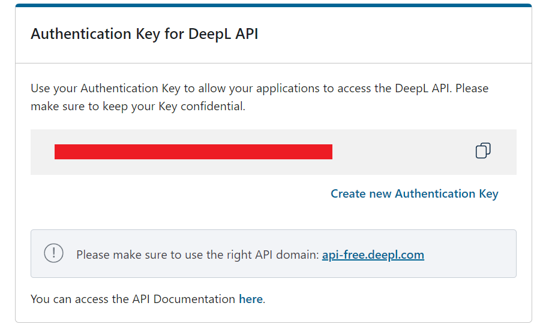

# Translate By Deepl

#### Introduction

Calling the API of deepl.com for PDF file translation and mainly solves the problem of uploading file size limitation.
By dividing the file to an appropriate size and merging after translation, large file translation is realized.

#### Software Architecture

config.py is the parameter configuration file.

data.json is a database file.

#### Installation

1. Python 3 environment, install the required package in requirements.txt.
2. Register on the deepl.com, obtain the API authority key and fill in config.py.

3. Run main.py

#### Instructions

1. Open http://127.0.0.1:9090
2. Upload file
3. Refresh the page, view the list of uploaded files, wait for the completion of file translation, and click the query
   button to obtain the translation status.

4. When the status is "ok" or "dl", refresh the page and click the download button to download the translated document.
5. Status description: "ng" means uploaded but not translated, "ok" means uploaded and translated, "dl" means translated
   and cached to the server.
6. Note 1: deepl.com has a translation word limit for free accounts, with a maximum of 500000 characters per month and a
   minimum of 50000 characters use per document. You can register multiple accounts to increase the number of
   translations.
7. Note 2: deepl.com limits the maximum upload file size to 10MB, the size setting in config.py should not be too large.
