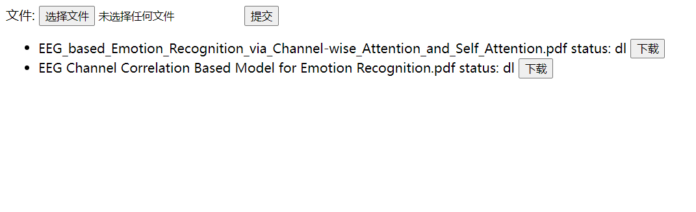

# Translate By Deepl

#### 介绍

调用deepl.com的API进行pdf文件翻译，主要解决了上传文件大小限制的问题，通过分割文件到合适的大小，翻译后再合并，实现了大文件翻译。

#### 软件架构

config.py 为参数配置文件

data.json 为数据库文件

#### 安装教程

1. python3环境，安装requirements.txt内所需依赖。
2. deepl官网注册登录，获取API验证密钥并填写到config.py

3. 运行main.py

#### 使用说明

1. 浏览器打开http://127.0.0.1:9090
2. 上传文件
3. 刷新页面，查看已上传文件列表，等待文件翻译完成，点击查询按钮获得翻译状态

4. 状态为"ok"或"dl"时刷新页面，点击下载按钮下载翻译后的文档
5. 状态说明："ng"为已上传未翻译完成，"ok"为已上传且翻译完成，"dl"为翻译完成且文件已缓存到服务器
6. 注意1：deepl对免费帐户有翻译字数限制，每月最多500000字符用量，每篇文档最少花费50000字符用量，可注册多个账户以增加翻译数量
7. 注意2：deepl限制上传文件最大为10MB，config中的max_file_size设置不要太大
